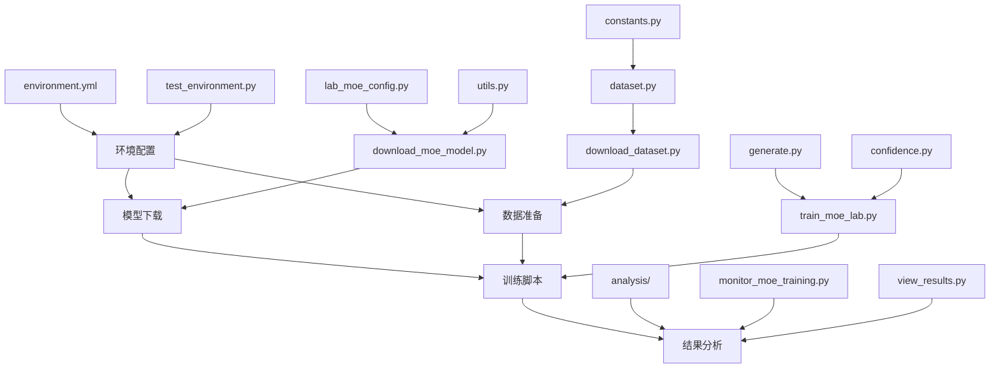

# 快速开始指南 - Quick Start Guide

## 🚀 **3分钟快速启动**

### 前提条件
- ✅ GPU环境 (至少1个GPU)
- ✅ Python 3.9+
- ✅ Conda已安装

### 核心命令 (复制粘贴即可)
```bash
# 1. 创建环境 (2-5分钟)
conda env create -f environment.yml
conda activate gyb-self-ensemble

# 2. 验证环境 (30秒)
python test_environment.py

# 3. 下载模型 (1-3小时，可后台运行)
nohup python download_moe_model.py > download.log 2>&1 &

# 4. 准备数据集 (1分钟)
python download_dataset.py

# 5. 快速测试 (2分钟)
python simple_myriadlama_test.py

# 6. 小规模训练测试 (5分钟)
python train_moe_lab.py --model_name qwen1.5_moe_a2.7b_chat --max_samples 10 --max_steps 5 --experiment_name quickstart_test
```

## 📊 **文件依赖关系图**



## 🔧 **核心文件功能速查**

### 💡 **一句话说明**

| 文件名                      | 一句话功能                             | 使用场景               |
| --------------------------- | -------------------------------------- | ---------------------- |
| `train_moe_lab.py`          | 🏃‍♂️ 主训练脚本，一键启动MoE训练          | 需要训练时直接运行     |
| `download_moe_model.py`     | 📥 自动下载Qwen1.5-MoE模型(28.6GB)      | 首次安装或重新下载模型 |
| `download_dataset.py`       | 📊 准备MyriadLLaMa数据集+备用测试数据   | 需要数据时运行         |
| `lab_moe_config.py`         | ⚙️ 服务器路径配置，改这个文件适配新环境 | 环境迁移时必须修改     |
| `test_environment.py`       | ✅ 环境检查工具，验证一切是否正常       | 安装后第一个运行的脚本 |
| `simple_myriadlama_test.py` | 🧪 快速功能测试，2分钟验证核心功能      | 想快速验证系统时运行   |

### 📁 **目录结构速查**

```
📦 self-ensemble/
├── 🏃‍♂️ **训练核心** (每天都用)
│   ├── train_moe_lab.py          # 主训练脚本
│   ├── generate.py               # 生成答案
│   ├── dataset.py                # 数据处理
│   └── confidence.py             # 置信度计算
├── ⚙️ **配置文件** (安装时改一次)
│   ├── lab_moe_config.py         # 路径配置 ⚠️ 必须修改
│   ├── environment.yml           # Conda环境
│   └── constants.py              # 全局常量
├── 📥 **数据准备** (首次运行)
│   ├── download_moe_model.py     # 下载模型(28.6GB)
│   └── download_dataset.py       # 下载数据集
├── ✅ **测试验证** (有问题时运行)
│   ├── test_environment.py       # 环境检查
│   ├── simple_myriadlama_test.py # 快速测试
│   └── test_moe.py              # MoE模型测试
├── 📊 **分析工具** (查看结果时用)
│   ├── analysis/                 # 结果分析脚本
│   ├── monitor_moe_training.py   # 训练监控
│   └── view_results.py          # 结果查看器
└── 📚 **文档指南** (迁移时必读)
    ├── PROJECT_DOCUMENTATION.md  # 完整项目文档
    ├── FILE_INVENTORY.md         # 文件详细清单
    └── MIGRATION_CHECKLIST.md    # 迁移检查清单
```

## ⚡ **常用命令速查**

### 🎯 **我想做什么？找对应命令！**

| 我想做...          | 运行这个命令                               | 预期时间 |
| ------------------ | ------------------------------------------ | -------- |
| 🔧 检查环境是否正常 | `python test_environment.py`               | 30秒     |
| 📥 首次下载模型     | `python download_moe_model.py`             | 1-3小时  |
| 📊 准备训练数据     | `python download_dataset.py`               | 1分钟    |
| 🧪 快速功能测试     | `python simple_myriadlama_test.py`         | 2分钟    |
| 🏃‍♂️ 开始小规模训练   | `python train_moe_lab.py --max_samples 10` | 5-10分钟 |
| 📈 查看训练监控     | `python monitor_moe_training.py`           | 实时     |
| 📊 分析训练结果     | `python view_results.py`                   | 1分钟    |
| 🔍 检查GPU使用率    | `nvidia-smi`                               | 即时     |

### 🚨 **出错了？快速诊断！**

| 错误现象           | 快速检查命令                                                                         | 可能原因            |
| ------------------ | ------------------------------------------------------------------------------------ | ------------------- |
| 😵 "CUDA不可用"     | `python -c "import torch; print(torch.cuda.is_available())"`                         | GPU驱动/PyTorch问题 |
| 📁 "找不到模型文件" | `ls ~/shared_storage/models/moe/`                                                    | 模型未下载完成      |
| 💾 "内存不足"       | `free -h; nvidia-smi`                                                                | 需要减少batch_size  |
| 🌐 "网络连接失败"   | `ping huggingface.co`                                                                | 网络或代理问题      |
| ⚙️ "配置文件错误"   | `python -c "from lab_moe_config import LAB_SERVER_CONFIG; print(LAB_SERVER_CONFIG)"` | 路径配置错误        |

## 🎯 **典型使用流程**

### Scenario 1: 全新环境安装 (新手)
```bash
# Step 1: 环境准备 (5分钟)
conda env create -f environment.yml
conda activate gyb-self-ensemble
python test_environment.py

# Step 2: 模型下载 (后台运行，1-3小时)
nohup python download_moe_model.py > download.log 2>&1 &

# Step 3: 数据准备 (1分钟)
python download_dataset.py

# Step 4: 验证安装 (2分钟)
python simple_myriadlama_test.py

# Step 5: 小规模试跑 (5分钟)
python train_moe_lab.py --max_samples 5 --max_steps 3 --experiment_name test_run
```

### Scenario 2: 日常训练使用 (熟练用户)
```bash
# 激活环境
conda activate gyb-self-ensemble

# 开始训练 (根据需要调整参数)
python train_moe_lab.py \
  --model_name qwen1.5_moe_a2.7b_chat \
  --max_samples 1000 \
  --batch_size 4 \
  --max_steps 100 \
  --experiment_name my_experiment_$(date +%Y%m%d_%H%M)

# 监控训练过程
python monitor_moe_training.py

# 查看结果
python view_results.py --experiment_name my_experiment_*
```

### Scenario 3: 问题诊断 (故障排除)
```bash
# 全面环境检查
python test_environment.py

# 检查模型完整性
python -c "
from transformers import AutoConfig
from lab_moe_config import LAB_SERVER_CONFIG
config = AutoConfig.from_pretrained(LAB_SERVER_CONFIG['model_cache_dir'] + '/qwen1.5_moe_a2.7b_chat/')
print(f'模型加载成功: {config.model_type}')
"

# 检查GPU状态
nvidia-smi

# 最小化测试
python train_moe_lab.py --max_samples 1 --max_steps 1 --batch_size 1
```

## 🎨 **个性化配置**

### 修改模型存储路径
```python
# 编辑 lab_moe_config.py
LAB_SERVER_CONFIG = {
    "model_cache_dir": "/your/custom/path/models",  # 改这里
    "dataset_cache_dir": "/your/custom/path/datasets",  # 改这里
    "experiment_dir": "/your/custom/path/experiments"  # 改这里
}
```

### 调整训练参数
```python
# 编辑 train_moe_lab.py 中的默认参数，或使用命令行参数
python train_moe_lab.py \
  --batch_size 8 \        # 批次大小(根据GPU内存调整)
  --max_samples 2000 \    # 样本数量
  --max_steps 200 \       # 训练步数
  --learning_rate 1e-5 \  # 学习率
  --output_dir /custom/output/path
```

---
**💡 提示**: 
- 🔥 首次使用建议按照"全新环境安装"流程操作
- 📖 遇到问题先查看`PROJECT_DOCUMENTATION.md`
- 🚨 出现错误使用"问题诊断"流程
- ⚙️ 环境迁移使用`MIGRATION_CHECKLIST.md`

**⏰ 时间估算**: 完整首次安装约2-4小时(主要是模型下载时间)，日常使用训练5-30分钟不等。